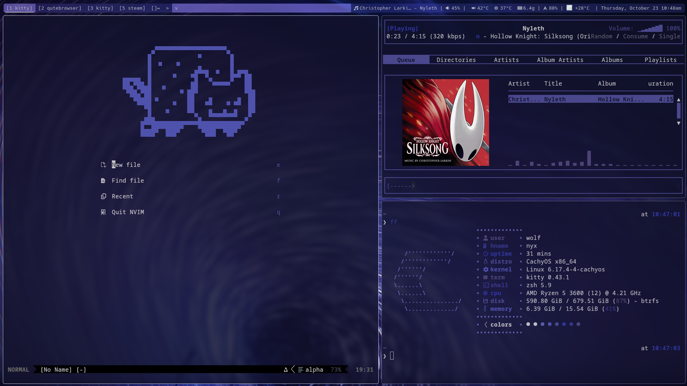

<h2 align="center">phoenyx </h2>

<h2 align="center">
      
</h2>

`phoenyx` is my "ecosystem" for my Linux desktop.
It includes configurations of the applications I use on a daily basis (in this repository)
Other components:
-  Wallpapers
-  Media server stack (*arr apps)
-  Build of the `dwm` window manager
-  Build of the `dmenu` run launcher
-  Build of the `dwl` Wayland compositor

