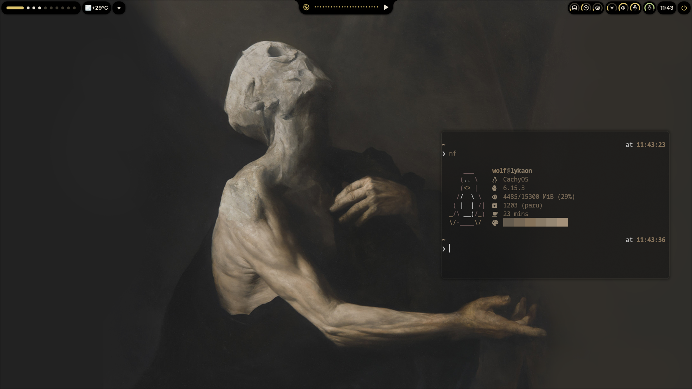

# phoenyx


[](https://github.com/ulfurloyd/phoenyx/actions/workflows/ansible-check.yml)

## Why I'm back on Arch
Spent close to a year in NixOS. It was honestly a lot of fun, Nix is a cool playground to learn new tools and build a deep configuration. <br><br>
But over time, I've also noticed growing pains that come with using Nix(OS) as your daily driver desktop distro. <br><br>
Issues mainly stemming from it not respecting traditional Linux FHS standards, software needing to be configured in a blend of home-manager <br>
and classic configuration formats, config changes not reflecting until you rebuild your system or HM config, and more. <br><br>
As it turns out, Arch Linux has a way to be enticing enough that you never tyruly escape it :3 <br>


## Ansible
Ansible is a system/configuration management and automation software. I'm working on integrating it into my dotfiles for easy system reproducibility, à la NixOS.

## Features So Far
### Package Management
Installs required packages
- `pacman` for official Arch packages (via the base role)
- `paru` and ansible.aur Ansible module for AUR packages (via the aur role)
### Host-Specific Package Lists
- Variables for packages are stored in `vars/common.yml`, `vars/nyx.yml`, and `vars/lykaon.yml` to separate common and per-machine packages.
- Hostname of the current machine is detected automatically via `ansible_hostname`.
### User Setup
- Creates an `aur_builder` user that does all the AUR installations.
- Configures sudo permissions for that user without password for `pacman`.
### Dotfiles & Emacs Configuration
- Dotfiles (managed by Chezmoi) are included and applied post-install.
- Emacs is installed via `base`, and my Emacs configuration is pulled into `~/.config/emacs` using a dedicated `emacs` role.
### CI Integration
CI is handled via GitHub Actions using the `ansible_check.yml` workflow:
- Performs a dry-run (`--check`) for both `nyx` and `lykaon` using matrix builds.
- Installs dependencies and runs `ansible-lint` to validate against best practices.
- Uses conditional logic to avoid privileged `become_user` tasks when running in CI (`aur_user` is set to `ansible_user_id` if `$CI` is set).

This workflow is triggered on every push to `ansible/**` or on any PR.

To test locally:
```bash
ansible-playbook ansible/playbook.yml \
    -i localhost, \
    --connection=local \
    -e "ansible_hostname=$(hostname)"
```

# Directory Overview
```
~/.local/share/chezmoi/
├── ansible/
│   ├── roles/
│   │   ├── base/     # installs pacman packages
│   │   ├── aur/      # installs paru and AUR packages
│   │   └── emacs/    # pulls Emacs config
│   ├── vars/
│   │   ├── common.yml
│   │   ├── nyx.yml
│   │   └── lykaon.yml
│   └── playbook.yml
└── dot_config (chezmoi-managed config)
```
