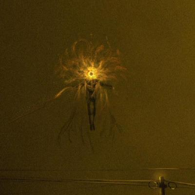
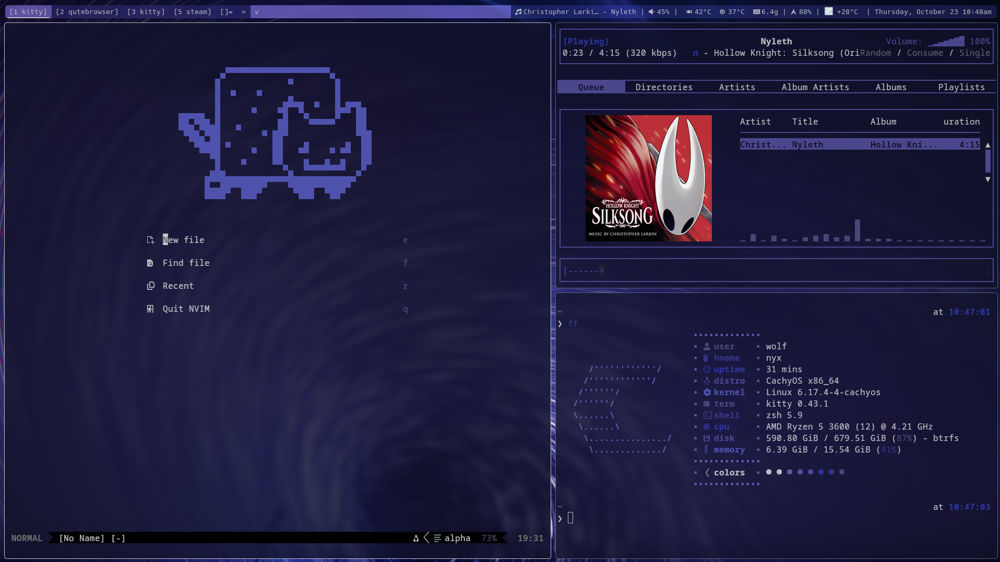

<h2 align="center">phoenyx </h2>

<h2 align="center">
     <br />
</h2>



`phoenyx` is my "ecosystem" for my Linux desktop.
It includes configurations of the applications I use on a daily basis (in this repository)

### Provisioning

This repo includes an [Ansible](https://www.ansible.com/) playbook to install packages and clone git repositories onto a fresh machine.

```
provision
```

- Installs official packages via `pacman` and AUR packages via `paru`
- Clones [phoenyx-wallpapers](https://github.com/ulfurloyd/phoenyx-wallpapers) and [phoenyxlab](https://github.com/ulfurloyd/phoenyxlab)
- Host-specific packages are defined separately for `nyx` (desktop) and `hermes` (laptop)
- To customize, edit `ansible/group_vars/all/vars.yml` or `ansible/host_vars/<hostname>.yml`

### Other components:
-  Wallpapers
-  Kubernetes-run homelab
-  Build of the `dwm` window manager
-  Build of the `dmenu` run launcher
-  Build of the `dwl` Wayland compositor

